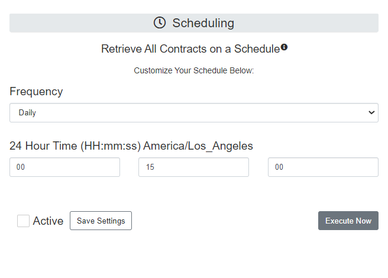

# What is Lenovo Warranty Import?

   

Lenovo Warranty Import allows any organization to gain immediate control of their Lenovo hardware contracts by natively bringing in your warranties and leases from Lenovo into ServiceNow, automatically creating those contracts and associating them to their respective hardware assets. 

## One-Click "Get Contract" Updates

- We all know that sometimes in an asset's hardware lifecycle, the latest contract info isn't there; maybe the asset is new, refreshed, or had an upgraded contract recently. Retrieving those contracts ASAP is not an issue anymore by using the "Get Contract"  UI Action available on all Lenovo hardware assets, which brings the ease of grabbing the latest contract details directly to your day to day asset management experience.

## Scheduled Contract Retrieval

- Selecting a schedule to update all your contracts is super simple and takes no more than 2 minutes to set up! Or, if you are impatient like most of us, you can also update all your asset contracts right away!

## Fully Imported Contract Details

- Lenovo Warranty Imports brings you every last possible detail of information it can about a provided hardware vendor contract. Although out of the box ServiceNow fields are used when creating a hardware contract (Vendor, Start / End Date, Renewal Start / End Date, etc.…), sometimes there is data that just doesn't fit, or you want to see it all at a glance. What Lenovo Warranty Imports does to solve this problem is summarize all that latest data for you in the Contract Description field for easy review when needed.

# Downloading the app

Check out the <a href= "https://www.by-daniel.com/post/lenovo-step-by-step-guide" target="_blank">Lenovo Warranty Import Knowledge Base</a> for a full step-by-step setup guide!

# Contributing

If there are features you would like to add to Lenovo Warranty Import, feel free to fork the app then create a pull request! Make sure to leave a detailed desciption about the nature of the code update.

Make sure to check out the <a href= "https://www.by-daniel.com/post/lenovo-step-by-step-guide" target="_blank">Lenovo Warranty Import Knowledge Base</a> for a run down of the app!